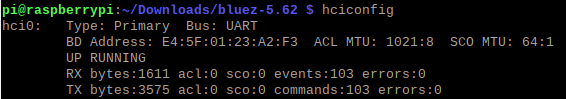
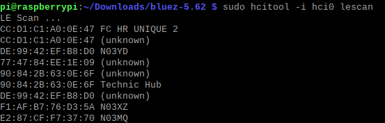
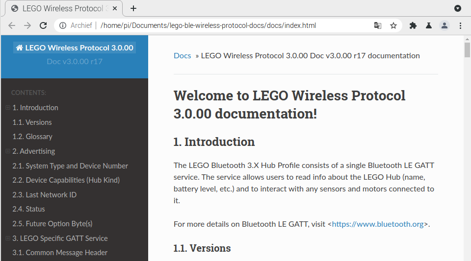

# Program Lego Powered Up

I don't like controlling my Liebherr 9800 model with the Lego Power+ Android app. Controls on a touch screen just plain suck. Also I'd like another programming language than the graphical blocks Lego uses.

Eventually I hope to use the [Raspberry Pi Zero 2 W](https://www.raspberrypi.com/products/raspberry-pi-zero-2-w/) in a custom enclosure with fysical knobs to controll my Lego sets.

The development I'll do on a Raspberry Pi 4 with 4 gigs of ram. The low power Zero does not make a great development computer.

The Lego Powered Up brick connects with Bluetooth Low Engergy (BLE) and this is available for most Raspberry Pi's.

## Bluetooth Low Energy
According to `apt search` the `bluez` package for Bluetooth support is at version 5.50-1.2. To install the latest version, currently 5.62, I followed instructions from [here](https://www.argenox.com/library/bluetooth-low-energy/using-raspberry-pi-ble/). 

`hciconfig` shows the hci0 interface is up and running.



An lescan shows our Lego Technic Hub:



Reset in case interface isn't behaving correctly:
```
sudo hciconfig hci0 down
sudo hciconfig hci0 up
```
Clicking the Bluetooth icon in the upper right corner and turning Bluetooth off and then back on again works as well.


## Lego BLE Wireless Protocol

If you clone [this](https://github.com/LEGO/lego-ble-wireless-protocol-docs) repository (or download the zip), you can locally browse everything you need to know about how to interact with the Lego hubs. 



Let's not dive into the deep just yet. There is a [Python library](https://github.com/undera/pylgbst) to interact with the hubs.

## Pylgbst

The author of this library, [Andrey Pokhilko](https://github.com/undera), suggests starting with looking into his [`demo.py`](https://github.com/undera/pylgbst/blob/master/examples/demo.py) file.

There is also a [MagPi article](https://magpi.raspberrypi.com/articles/hack-lego-boost-with-raspberry-pi) that takes you step by step towards getting to control your Lego hub.

No need to download an install it manually, pip3 can install the package just fine:

```
pip3 install pylgbst
```

Prerequisites for pylgbst:

```
pip3 install pexpect
pip3 install pygatt
pip3 install gatt
```

I found it necesarry to install `gatt` or the first experiment below would not work.

Make python3 the default on Raspberry pi:

```
sudo update-alternatives --install /usr/bin/python python /usr/bin/python3 10
```

That's also needed to stop VSCode from complaining about "Import could not be resolved" when using pylgbst.

## First steps

The first example on the Github page for pylgbst didn't work for me on my Raspberry Pi.

```Python
from pylgbst.hub import MoveHub

hub = MoveHub()

for device in hub.peripherals:
    print(device)
```

I had to manually controll the connection the `MoveHub` constructor uses. That's also the reason I had to install `gatt`.

```Python
from pylgbst.hub import MoveHub
from pylgbst import get_connection_gatt

conn = get_connection_gatt (hub_mac='90:84:2B:63:0E:6F')

hub = MoveHub(conn)

for device in hub.peripherals:
    print(device)
```

> Note that the mac address of my hub is **90:84:2B:63:0E:6F**, this will be different for other hubs.

Running right after I started the hub gave me this output:

```
pi@raspberrypi:~/Documents/ProgramLegoPoweredUp $ sudo python3 experiment.py 
Have no dedicated class for peripheral type 0x3c (TECHNIC_MEDIUM_HUB_TEMPERATURE_SENSOR) on port 0x3d
Have no dedicated class for peripheral type 0x3c (TECHNIC_MEDIUM_HUB_TEMPERATURE_SENSOR) on port 0x60
Have no dedicated class for peripheral type 0x39 (TECHNIC_MEDIUM_HUB_ACCELEROMETER) on port 0x61
Have no dedicated class for peripheral type 0x3a (TECHNIC_MEDIUM_HUB_GYRO_SENSOR) on port 0x62
Have no dedicated class for peripheral type 0x36 (TECHNIC_MEDIUM_HUB_GEST_SENSOR) on port 0x64
Got only these devices: (EncodedMotor on port 0x0, EncodedMotor on port 0x1, None, LEDRGB on port 0x32, None, Current on port 0x3b, Voltage on port 0x3c)
0
1
3
50
59
60
61
96
97
98
99
100
```
## Going Forward
This code makes the escavator go forward at full speed for one second, then at half speed for two seconds:

```Python
from time import sleep

from pylgbst import *
from pylgbst.hub import MoveHub
from pylgbst import get_connection_gatt

log = logging.getLogger("demo")

def demo_motors(hub):
    motor_left = hub.motor_A
    motor_right = hub.motor_B

    motor_left.start_power(1.0)
    motor_right.start_power(-1.0)
    sleep(1)
    motor_left.start_power(0.5)
    motor_right.start_power(-0.5)
    sleep(2)
    motor_left.stop()
    motor_right.stop()

if __name__ == '__main__':
    logging.basicConfig(level=logging.INFO, format='%(relativeCreated)d\t%(levelname)s\t%(name)s\t%(message)s')

    conn = get_connection_gatt (hub_mac='90:84:2B:63:0E:6F')
    hub = MoveHub(conn)

    demo_motors(hub)
    
```

I'm happy to get that working, I could try and controll all motors on the two bricks simultaniously but connecting to two bricks at once is a new challenge. Since the goal was remote controll of the excavator let's start with some input.

## Keyboard Controll

Let's see if we can make the excavator speed up and slow down with the up and down arrows on the keyboard and pressing the space bar should stop the machine.

### PyGame

I've used PyGame before and it makes listening for keyboard events easy so lets try that. On the Raspberry Pi I didn't even have to install PyGame.

```Python
from pylgbst import get_connection_gatt
from pylgbst.hub import MoveHub

import pygame

pygame.init()
display = pygame.display.set_mode((300, 300))

connection = get_connection_gatt(hub_mac='90:84:2B:63:0E:6F')
hub = MoveHub(connection)

motor_left = hub.motor_A
motor_right = hub.motor_B
motor_power = 0.0

def set_motors_power():
    motor_left.start_power(motor_power)
    motor_right.start_power(motor_power * -1)

def stop_motors():
    motor_left.stop()
    motor_right.stop()

while True:
    for event in pygame.event.get():
        if event.type == pygame.QUIT:
            pygame.quit()

        if event.type == pygame.KEYDOWN:
            if event.key == pygame.K_UP:
                print("UP")
                motor_power += 0.1
                set_motors_power()
            if event.key == pygame.K_DOWN:
                print("DOWN")
                motor_power -= 0.1
                set_motors_power()
            if event.key == pygame.K_SPACE:
                print("BRAKE")
                motor_power = 0.0
                stop_motors()
```

This works, altough it lets the variable for the power be more than 1 and smaller than -1 but I don't care for that now. In the end I don't want to use a keyboard but an XBox controller.


# Links
 - [about powered up](https://www.lego.com/en-us/themes/powered-up/about)
 - [magpi artikel](https://magpi.raspberrypi.com/articles/hack-lego-boost-with-raspberry-pi)
 - [magpi download](https://magpi.raspberrypi.com/issues/80/pdf/download) --> uittreksel zit al in deze repo

 - [BOOSTrevenge](https://github.com/JorgePe/BOOSTreveng)
 - [Lego BLE wireless protocol docs](https://github.com/LEGO/lego-ble-wireless-protocol-docs)
 - [issue discovering devices](https://github.com/undera/pylgbst/issues/7)
 - [pylgbst](https://github.com/undera/pylgbst) --> dit lijkt de compleetste

 - [using ble devices with a Raspberry Pi](https://www.argenox.com/library/bluetooth-low-energy/using-raspberry-pi-ble/)

  - [Control Bluetooth LE Devices From a Raspberry Pi
](https://www.instructables.com/Control-Bluetooth-LE-Devices-From-A-Raspberry-Pi/)